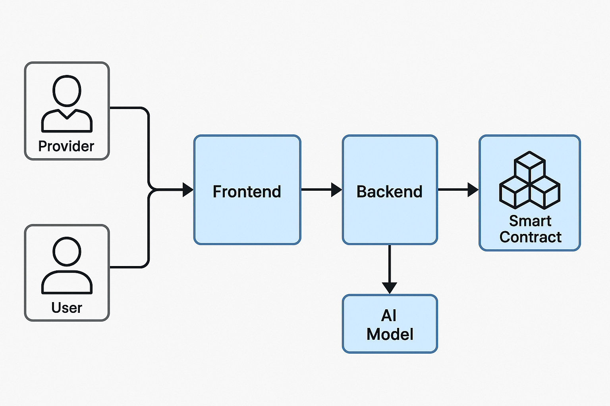
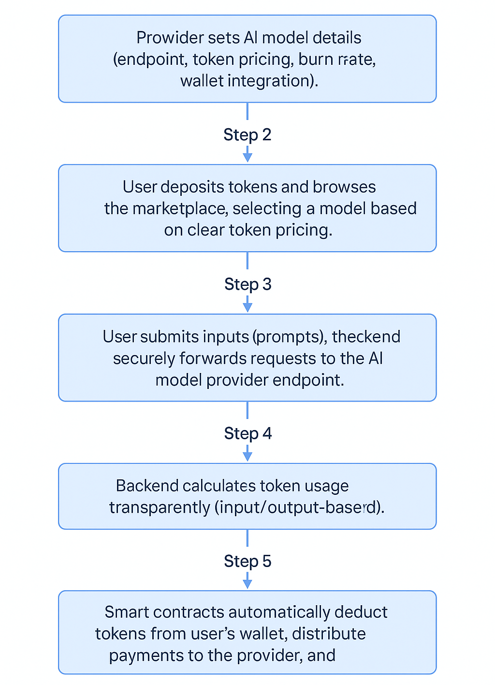

# Qulang - Decentralized AI Model Marketplace on Qubic Blockchain

- [Introduction](#1-introduction)
- [Overview and Technical Details](#2-overview-and-technical-details)
- [Core Features and Benefits](#3-core-features-and-benefits)
- [Use Cases and Examples](#4-use-cases-and-examples)
- [Development Roadmap](#5-development-roadmap)
- [Contributions and Community Engagement](#6-contribution-and-community-engagement)
- [Documentation and Maintenance](#7-documentation-and-maintenance)
- [Marketing Strategy](#-marketing-strategy)
- [Budget and Milestones](#-budget-and-milestones)
- [Team](#-team)
- [Conclusion](#8-conclusion)

## 1. **Introduction**
Qulang is an innovative decentralized marketplace built on the Qubic blockchain, specifically designed to democratize access to artificial intelligence (AI) models by seamlessly integrating blockchain-based micropayments. Leveraging the robust infrastructure of Qubic, Qulang enables individuals and organizations (Providers) to monetize their AI models through secure and transparent transactions, making sophisticated AI technologies accessible to end-users (Users) in an intuitive pay-per-use token model.

In the growing ecosystem of AI services, accessibility and transparency remain significant challenges. Traditional marketplaces often lack flexibility in pricing and transparency in usage tracking. Qulang addresses these issues by adopting a decentralized and token-based transactional model, powered entirely by Qubic blockchain smart contracts. Each transaction is tokenized, facilitating fair and clear micropayments based explicitly on the actual usage of AI models.

Qulang supports two primary account types to ensure smooth and tailored experiences:

- **Provider Accounts**: Users who offer AI models through Qulang, defining token pricing, burn rates, and connecting their wallets to smart contracts for automated transactions.
- **User Accounts**: Users who access and use AI models from the marketplace by funding their accounts with Qubic tokens. Tokens are consumed transparently based on model usage, with transaction histories securely stored and managed on-chain.

A distinctive feature of Qulang is the built-in deflationary mechanism through token burning. With every AI model transaction, a configurable portion of the tokens is permanently burned on the Qubic blockchain, enhancing token value stability and contributing positively to the broader Qubic economy.

By bridging advanced AI capabilities with blockchain transparency, Qulang sets out not only to simplify access to powerful AI technologies but also to empower AI model providers with a fair and sustainable monetization platform

## 2. Overview and Technical Details
Qulang is a decentralized AI marketplace built on top of the Qubic blockchain, providing a secure and transparent environment for distributing and monetizing AI models. It combines the power of blockchain technology, smart contracts, and modern web architecture to offer a robust solution tailored to providers and users.

### Platform Architecture
The architecture of Qulang comprises four main components designed to ensure scalability, transparency, and reliability:

**1. Blockchain Layer (Qubic Blockchain)**  
All financial and transactional processes are securely managed through the Qubic blockchain. This layer ensures transparent recording and immutable storage of every transaction and token burn event, thus establishing trust and reliability within the ecosystem.

**2. Smart Contracts**  
Qulang employs custom-developed smart contracts, specifically tailored to the requirements of the marketplace, following Qubic’s blockchain standards and documentation. Smart contracts manage essential tasks, including:  

- Payments and settlements in Qubic tokens.

- Tokenization of usage transactions (micropayments).

- Configurable token burning rates determined by providers.

- Secure integration and management of provider and user wallets.

Providers have autonomy in setting their token burn rates, choosing from predefined percentage tiers. This directly influences their visibility, ranking their AI models within the marketplace, incentivizing higher participation in the deflationary mechanism of Qulang.

**3. Backend Infrastructure (Next.js)**  
Qulang leverages Next.js as its primary backend framework, managing all logic related to marketplace operations, including user authentication, token calculation, and secure interactions with AI model endpoints and the blockchain. Core backend responsibilities include:

- **Token Calculation:**  
Tokens are computed based on usage metrics, specifically the input prompt size and output response complexity or length, enabling a precise and transparent billing process.

- **Secure API Communication:**  
Secure API endpoints facilitate authenticated and encrypted (TLS/SSL) interactions between the users, backend services, and the providers' AI endpoints.

**4. Frontend Application (Next.js)**  
The frontend interface, also built using Next.js, delivers an intuitive, responsive user experience, allowing seamless interaction with the marketplace:

- **Provider Interface:**  
Providers can effortlessly set up and manage their AI model offerings, including endpoint registration, token pricing, wallet management, and selection of burn rate tiers.

- **User Interface:**  
Users can easily explore available AI models, view clearly displayed token prices, deposit and manage their Qubic tokens, and seamlessly integrate wallet connectivity for smooth transactions.

](./technical_chart.png)

### **Technology Stack**
Qulang's comprehensive and scalable tech stack includes:

- **Blockchain & Smart Contracts:** 
  Qubic Blockchain (Custom Smart Contracts)

- **Backend & Frontend Framework:** 
  Next.js (server-side rendering and APIs)

- **Data Storage:** 
  MongoDB for structured data storage, complemented by decentralized storage solutions like IPFS for enhanced transparency.

- **Security & Privacy:** 
  Robust encryption standards (TLS/SSL), secured API endpoints, and wallet integration to safeguard user and provider data.

### **Transaction Workflow Example**
A detailed transaction scenario within Qulang involves the following steps:

#### **Provider Workflow:**

1. The provider creates an account, registering their wallet, AI model endpoint, and sets the token price per usage.

2. The provider selects a token burn percentage from predefined tiers, influencing the visibility and rank of their model in the marketplace.

3. Smart contracts are automatically configured and deployed, managing future transactions and token burns autonomously.

#### **User Workflow:**

1. User registers and connects their Qubic wallet.

2. User deposits Qubic tokens into their Qulang account.
3. User navigates through the marketplace, selects an AI model based on clearly stated token pricing.
4. After sending their input, the backend calculates tokens consumed based on the request's complexity and response length.
5. Tokens are automatically deducted from the user's account, part of which is burned according to provider-configured settings.
6. The provider receives their token share seamlessly via blockchain smart contracts.

## **3. Core Features and Benefits**

Qulang introduces a comprehensive suite of features designed to maximize efficiency, transparency, and profitability in AI model sharing and usage, powered by blockchain and decentralized principles. Below are its core functionalities and the unique benefits they provide:

**1. Decentralized AI Marketplace**  
- **Feature:** Fully decentralized platform built on the Qubic blockchain, offering secure and transparent interactions.

- **Benefit:** Eliminates central authority, reducing the risks associated with centralized systems, such as data misuse, transaction opacity, and censorship.

**2. Flexible Token-Based Micropayments**  
- **Feature:** Tokenized transactions allow precise pay-per-use billing, calculated dynamically based on AI input/output complexity.

- **Benefit:** Providers and users achieve fair, transparent pricing, aligned directly with actual AI usage, ensuring cost-effectiveness and transparency.

**3. Provider-Configurable Token Burn Rate**  
- **Feature:** Providers can choose their own token burn rate from predefined tiers, influencing their model’s ranking and visibility on the marketplace.

- **Benefit:** Encourages competition and engagement, rewarding providers who support a higher token burn rate with greater marketplace visibility, driving community-oriented ecosystem growth.

**4. Automatic and Transparent Smart Contracts**  
- **Feature:** Custom-developed smart contracts manage all financial transactions, token distribution, and burning autonomously.

- **Benefit:** Ensures trust and transparency, minimizes administrative overhead, and provides a robust automated settlement mechanism without intermediaries.

**5. Secure Wallet Integration**  
- **Feature:** Seamless wallet connectivity for secure token management and transactions directly through the Qubic blockchain.

- **Benefit:** Simplifies user onboarding, enhances security, and facilitates efficient and secure handling of tokens, removing complexities associated with traditional payment methods.

**6. Dynamic Marketplace Ranking**  
- **Feature:** Marketplace ranking influenced by token burn rate, incentivizing providers to contribute positively to token scarcity.

- **Benefit:** Dynamically rewards active community contribution, aligning incentives between model providers, users, and the broader Qubic ecosystem.

**7. Robust Security and Privacy Standards**  
- **Feature:** End-to-end encryption (TLS/SSL) and secure API endpoints ensure user data and interactions remain protected.

- **Benefit:** Provides peace of mind and compliance with industry-standard security protocols, essential for sensitive data involved in AI processing and transactions.

**8. Comprehensive User and Provider Dashboards**  
- **Feature:** User-friendly interfaces offering clear insights into transaction histories, token usage, wallet balances, and model analytics.

- **Benefit:** Enhances transparency, simplifies management tasks, and improves overall user experience by presenting critical information intuitively.

**9. Scalable Backend Infrastructure**  
- **Feature:** Built using Next.js for both backend and frontend, Qulang ensures robust scalability and performance.

- **Benefit:** Ensures the platform remains responsive and performant, supporting increased user load and AI model complexity without compromising reliability or speed.

## **4. Use Cases and examples**

Qulang’s decentralized AI marketplace addresses real-world challenges faced by both AI model providers and end-users. Below are concrete scenarios demonstrating typical usage patterns and highlighting the practical advantages of Qulang.

### **Use Case 1: AI Model Provider Monetization**
**Scenario:**

Alice, an AI developer specializing in Natural Language Processing, has developed a sophisticated GPT-based language generation model. Previously, Alice faced challenges monetizing her model directly to users due to payment complexities, opaque pricing, and administrative overhead.

**Qulang Solution:**

- Alice creates a Provider account on Qulang.

- She registers her AI model endpoint, specifying clearly defined usage costs per token and selects a burn rate tier to boost visibility.

- Alice connects her wallet, allowing smart contracts to handle all payments automatically.

**Outcome:**

- Alice easily monetizes her AI model directly through transparent token payments.

- Her model becomes widely accessible without intermediaries, allowing efficient revenue generation and visibility.

### **Use Case 2: Pay-Per-Use AI Model for Businesses**
**Scenario:**

Bob runs a small marketing agency and occasionally requires advanced AI models for content generation and analytics but can't justify high monthly subscription fees typically demanded by centralized AI services.

**Qulang Solution:**

- Bob registers a User account, securely connects his wallet, and deposits Qubic tokens.

- He browses the marketplace, selects Alice's GPT-based model after comparing clearly indicated prices.

**Outcome:**  

- Bob benefits from flexible pay-per-use access without upfront investment or recurring fees.

- His business can access powerful AI capabilities cost-effectively and transparently, scaling usage up or down as required.

### **Use Case 3: Competitive Marketplace Visibility**  
**Scenario:**

- Charlie, another AI model provider, wishes to maximize visibility and usage of his advanced image recognition model within the marketplace.

**Qulang Solution:**

- Charlie selects a higher token burn rate tier, signaling commitment to the community.

- His AI model gains higher visibility, appearing prominently in the marketplace rankings due to Qulang’s incentivized burn-rate system.

**Outcome:**

- Charlie’s model attracts more users, increasing revenue and marketplace reputation.

- His contribution to token deflation strengthens the Qubic ecosystem, benefiting all stakeholders.

### **Use Case 4: Seamless Integration of Blockchain and AI**
**Scenario:**

- Dana, a technology enthusiast, aims to leverage advanced decentralized platforms to incorporate AI into blockchain applications. However, typical AI services lack blockchain compatibility.

**Qulang Solution:**

- Dana accesses Qulang’s decentralized AI models with built-in blockchain integration, allowing direct token payments and transaction tracking.

- She integrates selected AI services seamlessly into her blockchain-based decentralized apps (dApps).

**Outcome:**

- Dana effectively bridges AI technology and blockchain ecosystems effortlessly.

- Her applications achieve enhanced functionality with simplified integration, providing value-added services to her users.
  

    
### **Workflow Example: Typical Transaction Flow**

## **5. Development Roadmap**
Qulang’s journey towards a fully operational decentralized AI marketplace has already begun, with an existing Proof-of-Concept (PoC) providing a foundational demonstration of key functionalities. This roadmap outlines our plan for continued refinement, enhancement, and eventual full-scale deployment, transparently highlighting current limitations and future improvements.

### **Current Status: Proof-of-Concept (PoC)**
At present, Qulang has an initial PoC demonstrating critical components:

- **Smart Contract Integration:**  
Basic smart contracts currently handle core marketplace interactions, such as token transactions, model endpoint registrations, and basic token burn mechanics. While operational, they require significant refactoring and enhancement for scalability and security.

- **Frontend Application:**  
An initial frontend interface built with Next.js exists but currently provides only fundamental interactions. The user experience (UX), model browsing, and especially the account registration processes require substantial improvements and better integration with backend services.

- **AI Model Provisioning:**  
AI models can currently be provided and accessed through the marketplace, although integration and the end-user experience remain limited.

### **Planned Development Milestones:**
#### **Phase 1: Smart Contract Refactoring and Enhancement**
- **Timeframe:** Q2 2025

- **Goals:**

  - Refactor existing smart contracts for improved efficiency and security.

  - Enhance smart contract capabilities for better configurability (provider-defined burn rates, dynamic pricing).

  - Implement extensive smart contract audits for security and reliability.

#### **Phase 2: Frontend and User Experience Revamp**
- **Timeframe:** Late Q2 - Early Q3 2025

- **Goals:**

  - Redesign the frontend application using Next.js, focusing on user experience and responsiveness.

  - Implement a more intuitive user interface for both providers and users, enhancing usability and accessibility.

  - Integrate advanced features such as real-time data updates, improved search capabilities, and enhanced model browsing.

  - Develop comprehensive documentation for users and providers to facilitate onboarding and usage.

    
#### **Phase 3: Backend Optimization and Security Improvements**
- **Timeframe:** Q3 2025

- **Goals:**

  - Refactor backend logic for improved performance and scalability.

  - Enhance API security and backend data encryption (TLS/SSL) standards.

  - Optimize backend infrastructure performance, reliability, and scalability.

  - Improve token calculation algorithms for greater precision, efficiency, and transparency.

#### **Phase 4: Marketplace Ranking and Burn-Rate Mechanism**
- **Timeframe:** Q3 - Early Q4 2025

- **Goals:**

  - Fully implement and rigorously test the provider-driven token burn rate tier system.

  - Integrate dynamic marketplace ranking influenced by token burn rates, encouraging competitive ecosystem contributions.

#### **Phase 5: Beta Release and Community Feedback**
- **Timeframe:** Q4 2025

- **Goals:**

  - Publicly release a Beta version for extensive user testing.

  - Collect user and provider feedback to inform final refinements and improvements.

  - Strengthen community engagement and expand marketplace visibility.

#### **Phase 6: Official Launch and Expansion**
- **Timeframe:** Q1 2026

- **Goals:**

  - Launch the fully operational Qulang marketplace with comprehensive documentation.

  - Initiate active onboarding of providers and promotion to potential users.
  - Explore additional features based on community feedback and marketplace demands.

## **6. Contribution and Community Engagement**

Qulang strongly values community collaboration and transparency, recognizing that the long-term success and growth of the platform depend upon active participation and continuous feedback from both AI providers and users. We aim to foster an open, collaborative ecosystem that empowers the broader Qubic community.

### **Ways to Contribute**
We actively encourage and warmly welcome community contributions in the following ways:

**1. Code Contributions and Technical Improvements**  
- Community developers are encouraged to contribute directly to the Qulang codebase via our GitHub repository:

  - **Frontend Enhancements:** Improving UX/UI, accessibility, and responsiveness.

  - **Backend Improvements:** Enhancing API efficiency, security, token calculation accuracy, and overall performance optimization.

  - **Smart Contract Development:** Assisting in auditing, improving, and proposing new features or optimizations.

**2. Testing and Feedback**  
- Community members can participate in beta testing phases, helping identify bugs, usability issues, and providing valuable suggestions for enhancements.

- Testing phases will be clearly announced on community channels, inviting structured and open-ended feedback.

**3. AI Model Provisioning**  
- AI developers are invited to list and provide their models on Qulang’s marketplace, enriching the platform’s diversity, innovation, and value.

- Providers receive immediate visibility and fair monetization opportunities through transparent tokenized payments.

**4. Documentation and Translation**  
- Contributions in the form of improved documentation, tutorials, and translation into various languages are highly valued, ensuring greater accessibility and usability for a global audience.

### **Community Engagement Initiatives**
To facilitate active community participation and ongoing dialogue, Qulang has planned several strategic initiatives:

**Regular Community Meetings and Workshops**  
- Scheduled live sessions to discuss platform development, gather feedback, announce updates, and conduct Q&A sessions.

**Online Community Channels**  
- Establishment of dedicated forums (Discord, Telegram, or similar platforms) for direct community interaction, announcements, issue reporting, and support.

**Contributor Recognition Program**  
- Community contributors will be publicly recognized and rewarded within the platform, showcasing their valuable contributions prominently on Qulang’s website and community channels.

**Educational Resources and Webinars**  
- Hosting periodic educational webinars and creating detailed resources to educate users on utilizing Qulang’s features effectively, understanding blockchain integrations, and optimizing AI model deployments.

  
By actively involving community members at every stage—from development and testing to deployment and expansion—Qulang seeks to build an inclusive, sustainable ecosystem that maximizes collective innovation and shared success.

## **7. Documentation and Maintenance**

Clear documentation and diligent maintenance are fundamental priorities for Qulang, ensuring long-term sustainability, ease of use, and community trust. We aim to provide detailed, accessible documentation and commit to proactive maintenance to guarantee optimal performance and continued innovation.

### **Comprehensive Documentation**
Qulang is committed to creating and continuously updating detailed documentation covering all critical components, designed to benefit both technical and non-technical community members.

Documentation includes:

### **1. Getting Started Guides**
- Easy-to-follow instructions on:

  - Account creation for users and providers.

  - Wallet connectivity and token management.

  - Marketplace browsing, AI model interaction, and token usage.

**2. Provider-Specific Documentation**  
- Detailed guides for providers on:

  - Model endpoint registration and integration.

  - Token pricing strategies and burn rate selection.

  - Monitoring model usage, transactions, and analytics.

**3. Technical Documentation**  
- In-depth coverage of:

  - Qulang’s smart contract architecture and interactions.

  - Backend API specifications, security protocols, and data handling procedures.

  - Frontend integration, customization, and deployment guidelines.

**4. Blockchain Integration and Smart Contracts**
- Clear explanations and references regarding:

   - Custom smart contract structures.
   - Tokenomics, transaction flows, and burn mechanics.

   - Security standards and blockchain-specific considerations.

**5. Community and Contribution Guidelines**  
- Clear and welcoming guidance for community contributions, code standards, and submission processes, fostering active participation.

### **Ongoing Maintenance and Support**
To ensure the robustness and reliability of Qulang, we commit to an active, transparent maintenance plan focusing on:

**1. Regular Updates and Enhancements**  
- Frequent codebase updates, performance optimizations, and feature improvements based on community feedback and emerging technology standards.

**2. Proactive Security and Auditing**  
- Regular security audits, vulnerability assessments, and swift responses to reported issues, ensuring platform safety and user confidence.

**3. Active Bug Tracking and Resolution**  
- Transparent public issue tracking and prioritization via GitHub Issues or similar platforms, allowing community visibility and contributions.

**4. Infrastructure Monitoring and Scalability**  
- Continuous monitoring of backend and blockchain interactions to proactively address potential bottlenecks, ensuring Qulang’s reliability as user and model usage grows.

**5. Community-Driven Maintenance**  
- Empowering community members to take ownership through structured contributions, promoting decentralized responsibility, and enhancing overall platform resilience.

Through meticulous documentation and proactive maintenance practices, Qulang is committed to providing a reliable, user-friendly, and continuously evolving platform, encouraging widespread adoption and sustained community engagement.

## **8. Marketing Strategy**

Qulang is committed to a robust marketing strategy to ensure strong visibility and adoption within the Qubic ecosystem and beyond. Our approach focuses on leveraging strategic partnerships, community engagement, and targeted outreach to maximize impact.
To ensure strong visibility and adoption of Qulang within and beyond the Qubic ecosystem, we are leveraging key strategic partnerships and communication channels:

* **Media Partnerships**:
  We have established collaborations with major French crypto media such as **CoinTribune** and **Cointelegraph France**, offering high-impact visibility for product launches and updates.

* **Key Opinion Leaders (KOLs)**:
  We're working with several French Twitter-based KOLs in the crypto and AI sectors to drive awareness and generate community engagement.

* **Qubic Ecosystem Channels**:
  We'll leverage existing Qubic communication tools:

  * Official announcements via **Qubic Discord**
  * Support and reposts through **Qubic's X.com (formerly Twitter)** accounts
  * Participation in **community events and developer calls**

This multi-pronged strategy ensures Qulang reaches a wide, relevant, and engaged audience—particularly developers, early adopters, and investors in the Qubic ecosystem.

## **9. Budget and Milestones**

The Qulang development is planned in **two phases**, the first being funded by our **\$10K Hackathon prize**, and the second requiring **\$25K in additional funding** post launch to scale the project further.

### **Phase 1 — Hackathon-Funded Milestones (\$10K)**

| Milestone       | % of Budget | Amount  | Objective                                                                                                                                                  |
| --------------- | ----------- | ------- | ---------------------------------------------------------------------------------------------------------------------------------------------------------- |
| **Milestone 1** | 40%         | \$4,000 | Finalize smart contract development and Qubic integration.                                                                                                 |
| **Milestone 2** | 30%         | \$3,000 | Complete initial AI module integration and basic functional AI model usage.                                                                                |
| **Milestone 3** | 30%         | \$3,000 | Launch basic marketing (media/KOLs), deploy the app in production, and conduct a smart contract audit via **RD Company**, who offered a reduced audit fee. |

### **Phase 2 — Additional Funding (\$25K)** post launch (Grant, private investors and IPO)

| Milestone                         | Objective                                                                                                                           |
| --------------------------------- | ----------------------------------------------------------------------------------------------------------------------------------- |
| **Scalable V2**                   | Expand development team and architecture to enable real-time onboarding of AI model providers without requiring code-level changes. |
| **Multi-Model API Compatibility** | Support a wider range of AI model APIs beyond the current Vercel stream format.                                                     |
| **Operational Scaling**           | Strengthen infrastructure, UI/UX, and allow seamless provider onboarding, targeting real-world adoption and scalability.            |

## **10. Team**

Qulang is driven by a team of experienced engineers, researchers, and entrepreneurs with strong backgrounds in AI, Web3, and cybersecurity:

### **Rayan Drissi**

[LinkedIn](https://fr.linkedin.com/in/rayan-drissi-1b66421b3)

* CTO of multiple crypto projects (including one with a \$90M market cap).
* Founder of a dev agency with 10 engineers specializing in Web3, AI, and full-stack development.
* Graduate of a top 3 CS school in France.
* Selected as a "Pépite de France" entrepreneur for exceptional student-led innovation.

### **Sabir Mohamed**

[LinkedIn](https://fr.linkedin.com/in/sabir-mba)

* Graduate in Cybersecurity & Systems Engineering with an AI minor.
* Research experience in smart contract security and cloud data protection.
* Focuses on infrastructure optimization, Web3 architecture, and data security.

### **Rémy Siahaan**

[LinkedIn](https://fr.linkedin.com/in/remy-siahaan/en)

* Graduate in ML, Statistics & Finance from ENSAE Paris (Institut Polytechnique de Paris).
* Winner of several top-tier AI hackathons (Hi!Paris, SiaPartners, InnovHer, ACPR/Bank of France).
* Experience as Data Scientist at the French Central Bank and Research Assistant at CREST (economics/statistics lab).

---

## **8. Conclusion**

Qulang represents a significant step forward in the integration of blockchain technology and artificial intelligence, creating a uniquely transparent, decentralized marketplace built specifically on the Qubic blockchain. By empowering AI model providers with direct monetization opportunities, and offering users clear, pay-per-use access to advanced AI tools, Qulang democratizes access to cutting-edge technologies.

With its innovative token-based payment system, configurable token burning, and community-centric marketplace ranking, Qulang aligns incentives among all stakeholders—providers, users, and the broader Qubic community—fostering a sustainable and dynamic ecosystem.

As we move forward through our clearly defined development roadmap, we invite active contributions and collaboration from the community, believing strongly that collective engagement is the key to long-term success and innovation. Together, we can build a robust, reliable, and highly accessible platform that positions Qubic at the forefront of decentralized AI marketplaces.

We thank you for considering this proposal and warmly welcome your participation in shaping the future of Qulang.
