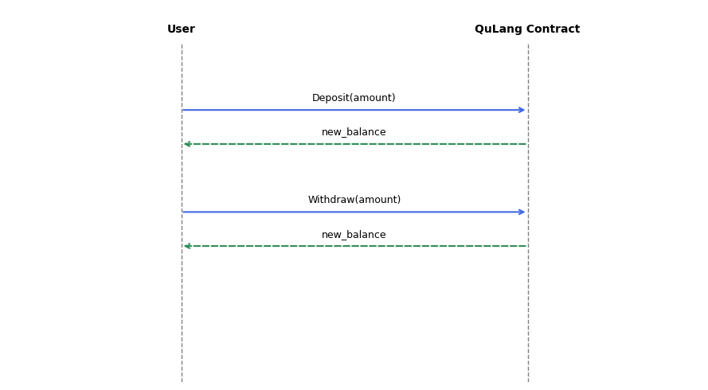
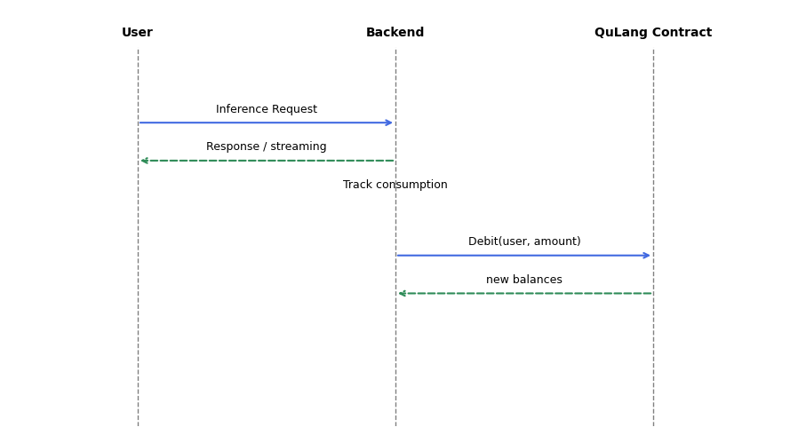
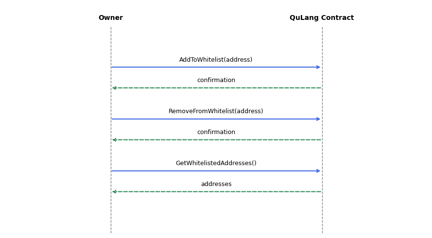
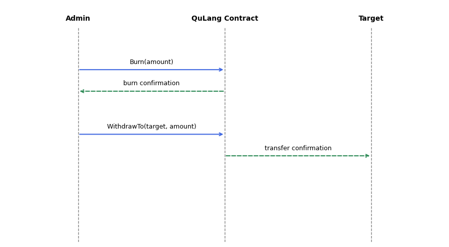

# QuLang Smart Contract – Technical Overview

## Introduction

The QuLang project integrates large language model (LLM) providers with the **Qubic** blockchain. Model providers expose inference endpoints and are compensated in Qubic tokens, while users pay for requests using tokens deposited in a smart contract. This document presents the technical design for the **Milestone 1** smart contract (planned delivery **31 July 2025**). The contract is implemented in C++ using the Qubic Programming Interface (QPI) and is available in the `dev‑contract` branch of the QuLang core repository. Its primary responsibilities are to maintain token balances for users, enforce administrative access via a whitelist, credit the contract balance when inference consumption is recorded and allow administrators to burn or distribute accumulated tokens.

The contract covers only on‑chain logic. All inference serving, consumption metering and pricing calculations happen **off‑chain** within the QuLang backend. At the end of a billing cycle an administrator calls the `Debit` procedure to reconcile off‑chain usage with on‑chain balances.

## Qubic Smart Contract Environment

Qubic contracts run on **computor** nodes and persist state across network ticks. QPI divides callable code into **functions** and **procedures**:

* **State** – persistent memory shared across all nodes. Qubic contracts define their state as member variables of a struct. The QuLang contract uses maps to track owners, a whitelist, user balances and the contract balance.
* **Functions** – read‑only; they **cannot change state** and are invoked via `RequestContractFunction` messages.
* **Procedures** – can **modify state**; they execute when the containing transaction is processed. Calling a procedure typically transfers an invocation reward to the contract.
* **Private** functions/procedures – only callable internally. `ensureWhitelisted` in QuLang is an example of a private function that aborts if the invocator is not authorised.
* **Registration** – for functions and procedures to be callable, they must be registered via `REGISTER_USER_FUNCTIONS_AND_PROCEDURES`. QuLang registers all public operations with numeric IDs.

Because QPI restricts dynamic memory, pointer arithmetic and certain operators, the QuLang contract uses QPI types such as `QPI::Map`, `id` and `uint64` instead of native C++ containers or primitive types.

## Contract State

The contract state consists of four persistent variables. Each variable is defined in the private section of the contract struct and is manipulated through public procedures and functions.

| State variable     | Type             | Purpose                                                                                                                                                                             |
| ------------------ | ---------------- | ----------------------------------------------------------------------------------------------------------------------------------------------------------------------------------- |
| `owner`            | `Map<id,id>`     | Stores the owner(s) of the contract; the key `"owner"` is set to the invocator during initialisation.                                                                               |
| `whitelist`        | `Map<id,bool>`   | Maps an address to a boolean indicating whether it is an administrator. Administrators can debit users and withdraw/burn contract funds; only the owner may modify the whitelist.   |
| `Users_balances`   | `Map<id,uint64>` | Maintains each user’s on‑chain balance. Balances increase on `Deposit` and decrease on `Withdraw`, `Burn` or `Debit`.                                                               |
| `contract_balance` | `uint64`         | Tracks the total tokens held by the contract. It is credited when users deposit or when administrators debit usage and debited when funds are withdrawn to third parties or burned. |

## Input and Output Structures

Each procedure/function uses `struct` definitions to describe its expected input and output. For example, `Deposit_input` contains a `uint64 amount`, while `Deposit_output` returns `uint64 new_balance`. The table below summarises the key input and output structures (only non‑empty fields are listed):

| Operation                 | Input parameters             | Output fields                                              |
| ------------------------- | ---------------------------- | ---------------------------------------------------------- |
| `Initialize`              | none                         | none                                                       |
| `AddToWhitelist`          | `address: id`                | none                                                       |
| `RemoveFromWhitelist`     | `address: id`                | none                                                       |
| `Deposit`                 | `amount: uint64`             | `new_balance: uint64`                                      |
| `Withdraw`                | `amount: uint64`             | `new_balance: uint64`                                      |
| `Burn`                    | `amount: uint64`             | `new_balance: uint64`                                      |
| `Debit`                   | `user: id`, `amount: uint64` | `new_user_balance: uint64`, `new_contract_balance: uint64` |
| `WithdrawTo`              | `to: id`, `amount: uint64`   | `new_contract_balance: uint64`                             |
| `GetBalance`              | none                         | `balance: uint64`                                          |
| `GetWhitelistedAddresses` | none                         | `count: uint64`, `addresses: Vector<id>`                   |

## Procedures

### `Initialize`

The contract must be initialised once. When an account invokes `Initialize`, the procedure checks whether the owner has already been set. If not, it stores the invocator’s address as the owner and adds the invocator to the whitelist. Subsequent calls abort with error 1. Initialization does not accept any parameters and does not return output.

### `AddToWhitelist`

Only the owner can add administrators. When `AddToWhitelist` is invoked, it compares the invocator to the stored owner and aborts with error 2 if they differ. If authorised, it sets `whitelist[input.address] = true`.

### `RemoveFromWhitelist`

This procedure removes an address from the whitelist. The procedure checks that the invocator is the owner; if not, it aborts with error 3. Otherwise, the specified address is erased from the `whitelist` map.

### `Deposit`

Users deposit tokens into the contract to fund future inference requests. `Deposit` takes an `amount` as input. The procedure retrieves the user’s current balance (0 if it does not exist), increments it by `amount` and saves it back to `Users_balances`. It then increases `contract_balance` by the same amount and returns the updated user balance. Note that the code checks `state.balances.exists` instead of `state.Users_balances.exists`; this appears to be a minor bug but does not change the conceptual behaviour.

### `Withdraw`

To withdraw tokens, a user specifies an `amount`. The procedure loads the user’s balance and verifies that it is at least the requested amount; insufficient funds lead to error 1. If sufficient, it reduces the balance, updates `Users_balances`, and calls `qpi.transfer(invocator, amount)` to transfer tokens to the user. The updated balance is returned.

### `Burn`

`Burn` allows administrators to destroy tokens from their own balance. It first ensures that the invocator is whitelisted using `ensureWhitelisted`. The procedure then loads the invocator’s balance, checks for sufficient funds, decrements the balance by `input.amount`, calls `qpi.burn` to remove the tokens from circulation and returns the new balance. Burning reduces the invocator’s balance but does **not** affect the contract balance.

### `Debit`

`Debit` is the mechanism through which the backend reconciles off‑chain usage. Only whitelisted administrators can call it. The administrator provides a `user` and an `amount`. The contract subtracts the amount from `Users_balances[user]` and **adds** the same amount to `contract_balance`. Both the user’s new balance and the updated contract balance are returned. If the user’s balance is insufficient, the procedure aborts with error 1.

### `WithdrawTo`

This procedure transfers funds from the contract balance to an arbitrary address. Only administrators may call it. It checks that `contract_balance` is large enough; insufficient funds trigger error 3. Otherwise, it deducts the requested amount from `contract_balance` and invokes `qpi.transfer(input.to, amount)`. The new contract balance is returned.

### Error Codes

The contract uses abort codes to signal failure:

* **1 – InvalidInput / InsufficientBalance.** Used when `Initialize` is called after ownership is established or when a withdrawal/debit/burn amount exceeds the user’s balance.
* **2 – Unauthorized.** Emitted when a non‑owner attempts to add an address to the whitelist.
* **3 – InsufficientBalance (contract).** Emitted when the contract balance is insufficient for `WithdrawTo`.
* **4 – NotWhitelisted.** Triggered by `ensureWhitelisted` when the invocator is not in the whitelist.
* **5 – AlreadyWhitelisted.** (Unused in the code but documented in comments.)

## Functions

### `GetBalance`

`GetBalance` is a read‑only function that returns the caller’s balance. It does not accept any input. The function checks whether the `Users_balances` map contains the invocator’s id; if present, it returns the stored balance; otherwise it returns 0.

### `GetWhitelistedAddresses`

This function returns all whitelisted addresses and the count of those addresses. Since the whitelist is private state, only administrators may call this function: it invokes `ensureWhitelisted` to verify the invocator before retrieving the keys of the `whitelist` map and setting the output count.

## Sequence Diagrams and Usage Flows

The following diagrams illustrate typical interaction patterns between users, the backend and the smart contract. Time flows downward; calls are drawn with solid arrows and responses with dashed arrows.

### Deposit and Withdrawal Flow

After creating an account, a user deposits tokens into the contract. Tokens remain locked in the user’s on‑chain balance until explicitly withdrawn or debited. The sequence below shows the deposit and subsequent withdrawal of funds:

1. **Deposit:** The user sends a `Deposit(amount)` call to the contract. The contract credits the user’s balance and contract balance and returns the new balance.
2. **Withdrawal:** Later, the user calls `Withdraw(amount)`. The contract checks that the user has sufficient funds, deducts the amount and transfers tokens back to the user via `qpi.transfer`.

### Inference Usage and Debit

Inference requests are handled off‑chain by the QuLang backend. Users send prompts to the backend, which streams model responses and accumulates token consumption. At the end of a billing period, an administrator debits users’ on‑chain balances via `Debit` and credits the contract balance. The sequence below illustrates this process:

1. **Inference Request:** A user sends a prompt to the backend (not on‑chain). The backend checks the user’s off‑chain balance and, if sufficient, forwards the request to the selected LLM provider. The response is streamed back to the user while consumption is recorded.
2. **Usage Tracking:** The backend updates an internal ledger of consumed tokens for each user. This ledger is not stored on the blockchain.
3. **Debit:** At the end of the day, an administrator invokes `Debit(user, amount)` on the smart contract. The contract ensures the caller is whitelisted, subtracts the amount from the user’s balance and adds it to the contract balance. The new balances are returned to the backend.

### Admin Management Flow

Only the contract owner may add or remove administrators. The following sequence diagram shows typical administrative interactions:

1. **Add Administrator:** The owner calls `AddToWhitelist(address)` to designate a new admin. The contract checks that the invocator is the owner and, if so, sets the address’s whitelist entry to `true`.
2. **Remove Administrator:** To revoke permissions, the owner calls `RemoveFromWhitelist(address)`. The contract again verifies ownership and deletes the address from the whitelist.
3. **List Whitelisted Addresses:** Administrators can inspect the whitelist by calling `GetWhitelistedAddresses()`. The contract verifies that the caller is whitelisted and returns the list and its size.

### Burn and Contract Payout Flow

Administrators may destroy their own tokens (`Burn`) or send accumulated contract funds to providers or investors (`WithdrawTo`).

1. **Burn:** A whitelisted administrator calls `Burn(amount)` to permanently remove tokens. The contract validates that the caller is whitelisted, checks balance sufficiency and invokes `qpi.burn(input.amount)`.
2. **WithdrawTo:** Administrators distribute rewards by invoking `WithdrawTo(to, amount)`. The contract verifies whitelisting and sufficient contract balance, subtracts the amount from `contract_balance` and transfers tokens to the specified address.

## Security and Access Control

Access control is enforced through the `owner` and `whitelist` maps:

* **Ownership:** The invocator of `Initialize` becomes the owner. Only the owner can add or remove administrators.
* **Whitelist Enforcement:** Sensitive procedures (`Burn`, `Debit`, `WithdrawTo` and `GetWhitelistedAddresses`) call the private `ensureWhitelisted` function, which aborts the transaction if the invocator is not in the whitelist.
* **Error Handling:** The contract uses QPI abort codes to signal invalid input, unauthorized access or insufficient funds. Because these aborts revert state changes, no partial updates occur when errors are encountered.

## Conclusion

The QuLang smart contract provides a minimal yet secure framework for managing user balances and distributing revenue for language‑model inference on the Qubic blockchain. Its on‑chain logic is intentionally simple—deposits, withdrawals, burns, debits and administrative functions—while the heavy lifting (inference, pricing, rate‑limiting and provider management) happens off‑chain in the backend. By leveraging QPI’s distinction between functions and procedures, the contract ensures that read‑only queries do not inadvertently modify state. The whitelist mechanism and error codes enforce strict access control and predictable behaviour. Together, these components support a scalable token‑metering system that can be extended in future milestones to include provider management, staking or governance without disrupting the core balance accounting model.
